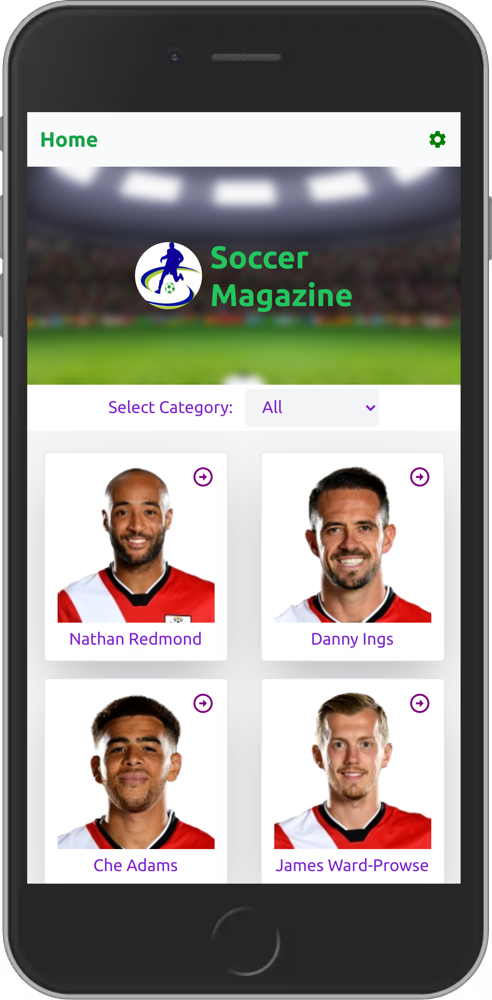
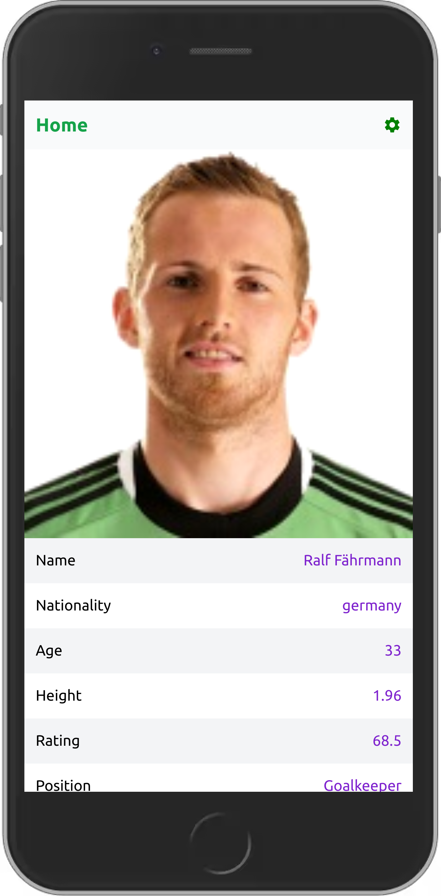

# Soccer Magazine
  Soccer Magazine is a SPA website for all football fans. It enables users to access the full information about many different football players.

<div>
  
  
</div>

# Built with
- React.js
- Redux
- Tailwind.CSS
- Jest

## Live Demo
Visit live demo [here](https://soccer-magazine-202.netlify.app/)

## installation

To get a local copy up and running follow these simple example steps.

- clone the repository by running
``` https://github.com/levy002/soccer_magazine ```
- navigate to the folder
``` cd <DIRECTORY> ```
- Install packages
``` npm i ```
- Run the app
``` npm start ```

# Author

👤 **Ukwishaka Levy**
- GitHub: [@levy002](https://github.com/levy002)
- Twitter: [@levy_ukwishaka](https://twitter.com/levy_ukwishaka)
- LinkedIn: [@levy-ukwishaka](https://www.linkedin.com/in/levy-ukwishaka/)

## :handshake: Contributing
Contributions, issues, and feature requests are welcome!
## Show your support
Give a :star:️ if you like this project!
## Acknowledgments

- Microverse offered guidance on how to make the project more professional
